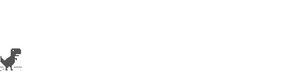
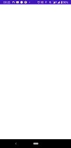
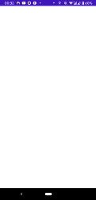
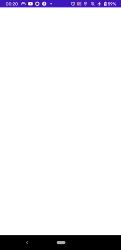

# T-Rex Game for Android (Google Chrome dino) [](https://jitpack.io/#LionZXY/T-Rex-Android)

This is port t-rex game for Android. Open in WebView.



## Get started

1. Add jitpack in your root build.gradle

```groovy
allprojects {
	repositories {
		...
		maven { url 'https://jitpack.io' }
	}
}
```

2. Add dependency

```groovy
dependencies {
	implementation 'com.github.LionZXY.T-Rex-Android:trex-library:1.0.0' // For only trex view
	// With progress bar: implementation 'com.github.LionZXY.T-Rex-Android:trex-progress:1.0.0'
    // Full offline: implementation 'com.github.LionZXY.T-Rex-Android:trex-offline:1.0.0'
}
```

|  |  |  |
|-|-|-|
| `TRexGameView` | `TRexProgressView` | `TRexOfflineView` |

3. Add View or Activity in project

### Activity

Just open activity:
```kotlin
TRexPlayActivity.open(this)
```
Or for offline view:
```kotlin
TRexOfflineActivity.open(this)
```

### View

Use view inside xml:
```xml
<com.lionzxy.trex_progress.TRexProgressView
    android:id="@+id/trex"
    android:layout_width="match_parent"
    android:layout_height="match_parent" />
```

Or create programmable:
```kotlin
val view = TRexProgressView(baseContext)
```

\[Optional\] Subscribe on progress:
```kotlin
trex.addProgressListener {
    Toast.makeText(baseContext, "Progress: $it", Toast.LENGTH_LONG).show()
}
```

\[Optional\] Force refresh:
```kotlin
trex.refresh()
```

\[Optional\] Set up custom url:
```kotlin
trex.setUrl("https://github.com/LionZXY/t-rex-runner/archive/minify.zip")
```

